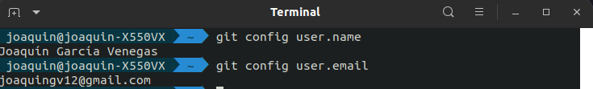

# Configuración de git

## Configuración SSH con clave pública
En primer lugar, hay que generar las claves pública y privada
`ssh-keygen -t rsa -b 4096 -C "joaquingv12@gmail.com"`

Añado la clave al agente de SSH
`ssh-add ~/.ssh/id_rsa`

Una vez hecho esto, habría que copiar la clave pública del archivo `~/.ssh/id_rsa.pub` para añadirla a la cuenta de github y quedaría así:

## Configurar nombre y correo electrónico
Para comprobar que tengo configurado correctamente mi nombre de usuario y el correo electrónico uso los comandos:
`git config user.name`
`git config user.email`

